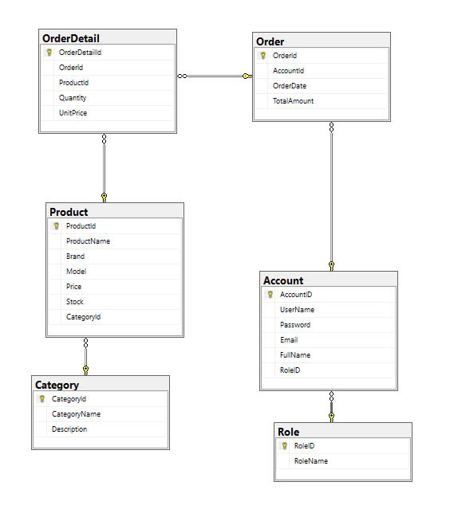

# 📢 Sale Laptop Management System (SLMS)

## 1. Introduction

A **Sale Laptop Management System (SLMS)** is a comprehensive solution designed to streamline inventory tracking, order processing, and sales reporting for laptop retailers. With a user-friendly interface and essential management tools, this system allows administrators full control over accounts, product categories, and orders while enabling staff to efficiently manage sales processes. Ideal for enhancing customer experience and operational efficiency, it’s the perfect choice for a smooth, professional laptop sales workflow.

## 2. Tech Stack

- **.NET 6**
- **WPF**
- **SQL SERVER 2019**

## 3. ERD

## 4. Main Functions

### 🛠️ Admin

- **Manage category information**
  - Delete an item if it is not associated with any product. Items stored in a product cannot be deleted.
- **Manage products (laptop)** (including tags)
- **View all order and order detail**
- **View personal news history**

## 5. Demo Videos
- Click the image to see demo video !
## 

---
